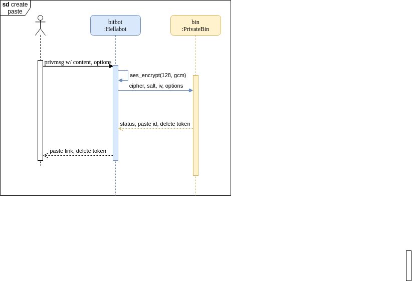

## usage and scenario
create a new paste
`/msg bitbot !paste <content>`

delete a paste
`/msg bitbot !paste --delete <delete_token>`

see [sample](https://github.com/PrivateBin/PrivateBin/blob/master/cfg/conf.sample.php) for sample server-side configuration file for privatebin (and for more ideas, like url-shortner)

the following sequence diagram represents the creation of a new paste:



## encryption format
from [here](https://github.com/PrivateBin/PrivateBin/wiki/Encryption-format#encryption); the following was request was sent with key `7MqznSyqHVx9VwNWfHRi6PLsr322eBY4Fnkx45tFV1gR`

```json
{
  "adata": [                                // auth data
    [
      "Yu5ECsseuJ07M2QBfdf3bA==",           // base64(cipher_iv); getRandomBytes(16) default
      "kvDZJC6IahU=",                       // base64(kdf_salt); getRandomBytes(8) default
      100000,                               // pbkdf_iterations; default
      256,                                  // pbkdf_keysize; default
      128,                                  // cipher_tag_size (wtf ?); default
      "aes",                                // cipher_algo; default
      "gcm",                                // cipher_mode; default
      "zlib"                                // compression_type; default
    ],
    "plaintext",                            // format of the paste - "plaintext" or "syntaxhighlighting" or "markdown"

    0,                                      // open-discussion flag
    0                                       // burn-after-reading flag (0 or 1)
  ],
  "meta": {
    "expire": "1week"
  },
  "v": 2,                                               // schema version
  "ct": "aVKpZWtKmTJKis5S6nYEL1rdxyPbHYFclHV3E6Kq99Tb"  // cipher text
}
```
prompt for password on wrong encryption keys

### Process data

If paste_password is an empty string:

```
paste_passphrase = random(32) # 32 bytes
```

if a paste_password has been specified:

```
paste_passphrase = random(32) + paste_password
```

Processing of the paste_data, if compression is enabled (the default):

```
paste_blob = zlib.compress(paste_data)
```

### Key derivation (PBKDF2)

Since passwords and keys are usually too short to be usable for encryption, it is common practice to use salted key derivation to turn such low entropy input into the actual key to use during en/decryption.

```python
kdf_salt = random(8) # 8 bytes
kdf_iterations = 100000 # was 10000 before PrivateBin version 1.3
kdf_keysize = 256 # bits of resulting kdf_key

kdf_key = PBKDF2_HMAC_SHA256(kdf_keysize, kdf_salt, paste_password)
```

The encrypted text is then:

```python
cipher_algo = "aes"
cipher_mode = "gcm" # was "ccm" before PrivateBin version 1.0
cipher_iv = random(16) # 128 bit
cipher_tag_size = 128

cipher_text = cipher(AES(kdf_key), GCM(iv, paste_meta), paste_blob)
```

## todo

* switch to a db instead of "file-less" configuration
* enable ability to delete
* enable paste cloning

